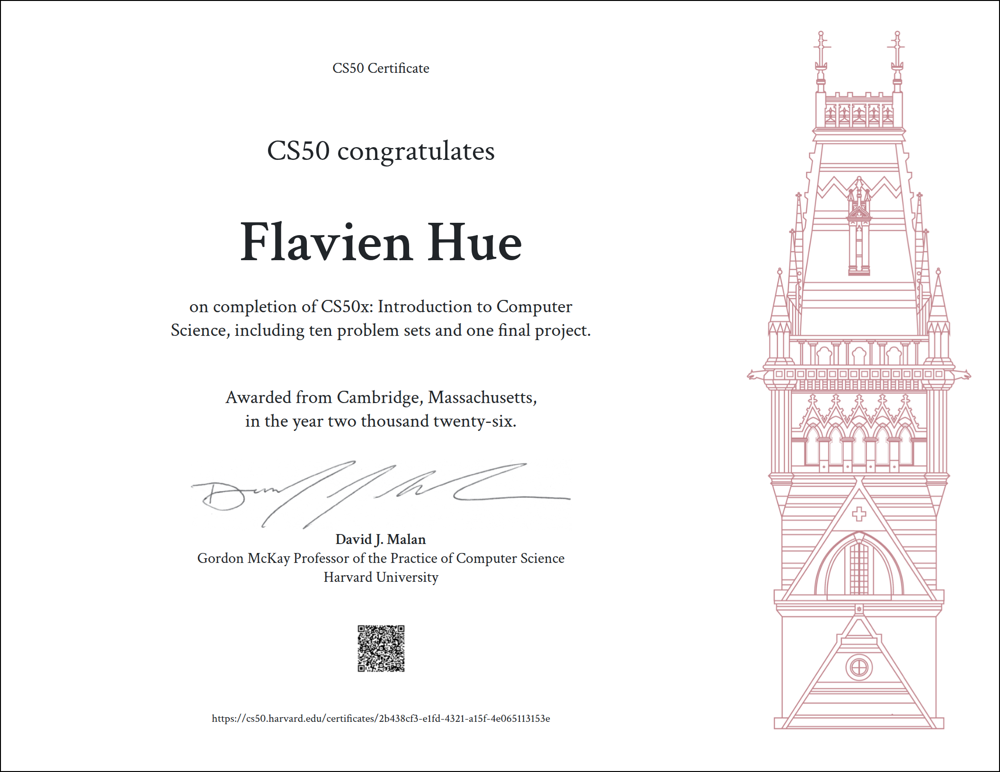

# CS50x — Introduction to Computer Science

> **Status: Completed (2026)** — [View Certificate](Certificate/CS50x.pdf)

My solutions to [Harvard's CS50x](https://cs50.harvard.edu/x/) problem sets, the world's largest introduction to computer science course.

This repository documents my journey learning the fundamentals of programming, algorithms, and computational thinking.



---

## Course Progress — All weeks completed

| Week | Topic | Status |
|------|-------|--------|
| 0 | Scratch | Done |
| 1 | C | Done |
| 2 | Arrays | Done |
| 3 | Algorithms | Done |
| 4 | Memory | Done |
| 5 | Data Structures | Done |
| 6 | Python | Done |
| 7 | SQL | Done |
| 8 | HTML, CSS, JavaScript | Done |
| 9 | Flask | Done |
| 10 | Final Project | Done |

---

## Week 0 — Scratch

An interactive project built with [Scratch](https://scratch.mit.edu/), MIT's visual programming language. This exercise introduces core concepts like loops, conditionals, variables, and event-driven programming without writing a single line of code.

**File:** `Week 0/Scratch Project.sb3`

---

## Week 1 — C

First steps with the C programming language: compiling, data types, operators, loops, and functions.

### `hello.c`
A simple program that greets the user by name. Covers standard I/O and string handling.

### `mario.c`
Prints a right-aligned pyramid of `#` blocks (inspired by Super Mario Bros). Demonstrates nested loops, user input validation, and modular design with a dedicated `print_row` function.

```
   #
  ##
 ###
####
```

### `credit.c`
Validates credit card numbers using **Luhn's algorithm** and identifies the card type (AMEX, Mastercard, or Visa). Involves arithmetic with `long` integers, digit extraction, and multi-condition logic.

---

## How to Run

These programs use the [CS50 library](https://cs50.readthedocs.io/libraries/cs50/c/). To compile and run:

```bash
# Install the CS50 library first, then:
make hello
./hello

make mario
./mario

make credit
./credit
```

Or compile manually:
```bash
gcc -o credit credit.c -lcs50
```

---

## What I Learned

- **Problem decomposition** — breaking complex problems into smaller, manageable functions
- **Input validation** — handling edge cases and rejecting invalid user input
- **Algorithm implementation** — translating a real-world algorithm (Luhn's) into working code
- **C fundamentals** — memory, types, control flow, and the compilation process

---

## About

CS50x certificate earned in **2026** after completing all 10 weeks and the final project.
Solutions for individual weeks will be added progressively to this repository.

Built by **Flavien** while learning computer science from the ground up.
